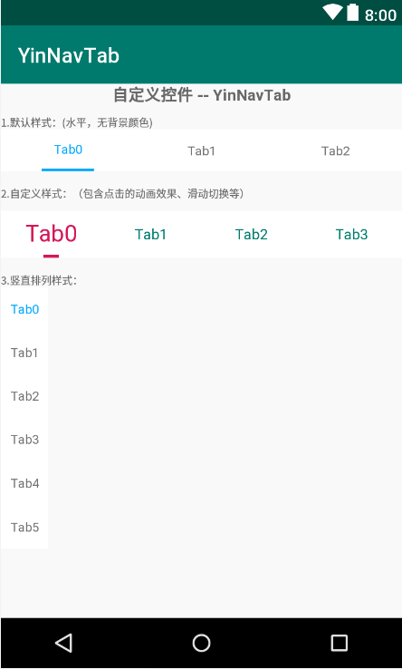

# :running:YinNavTab-Android (Kotlin) :running:

安卓自定义控件 --- 导航切换栏（按钮）

## 目录

* [功能介绍](#功能介绍)
* [整体效果图预览 apk](#整体效果图预览)
* [使用](#使用)
* [自定义属性](#自定义属性)
* [常见问题](#常见问题)


## 功能介绍

   基本功能：

- [x] 支持点击、滑动等多种监听事件进行tab切换
- [x] 随意设置tab数量、内容
- [x] 支持横向和纵向
- [x] 滑动或点击附带简单的缩放动画效果
- [x] xml配置内容的各种属性（文字、下标签等尺寸、颜色）


## 整体效果图预览

<div align=center></div>


# 使用

### 1.添加 Gradle 依赖
[](https://jitpack.io/#Jerry-Yin/YinNavTab)

Step 1. Add the JitPack repository to your build file.  Add it in your root build.gradle at the end of repositories:

	allprojects {
	    repositories {
		...
		maven { url 'https://jitpack.io' }
		}
	}

Step 2. Add the dependency

```groovy
dependencies {
    implementation 'com.github.Jerry-Yin:YinNavTab:latestVersion'
}
```

### 2.布局文件中添加YinNavTab控件进行布局

```xml
<com.jayyin.developer.yinnavtab.views.YinNavTab
    android:id="@+id/tab"
    android:layout_width="match_parent"
    android:layout_height="45dp">
</com.jayyin.developer.yinnavtab.views.YinNavTab>
```

### 3.在代码中设置绑定监听事件和其他后续操作

```kotlin
//绑定点击事件
tab.setOnClickListener(object : YinNavTab.OnClickListener {
   override fun onClick(view: View, position: Int) {
       Toast.makeText(this@MainActivity, "clicked tab " + position, Toast.LENGTH_SHORT).show()
   }
})

//绑定滑动事件
tab2.setOnScrollerListener(object : YinNavTab.OnScrollerListener {
    override fun onScroller(view: View, position: Int) {
       Toast.makeText(this@MainActivity, "scrolle to tab " + position, Toast.LENGTH_SHORT).show()
    }
})
```

# 自定义属性

对应属性，可以直接在xml中进行配置使用，也可以在代码中进行各种setxxx()使用，看自己需求！

```xml
    <declare-styleable name="YinNavTab">
        <!--文字/标签颜色-->
        <attr name="color" format="color"/>
        <!--选中时的文字颜色-->
        <attr name="colorSelected" format="color"/>
        <!--标签数量-->
        <attr name="tabSize" format="integer"/>
        <!--文字标题尺寸-->
        <attr name="titleSize" format="dimension"/>
        <!--标签指示器是否显示（默认显示）-->
        <attr name="indicatorsVisible" format="boolean"/>
        <!--指示器宽度-->
        <attr name="indicatorWidth" format="dimension"/>
        <!--指示器高度-->
        <attr name="indicatorHeight" format="dimension"/>
        <!--是否缩放动画效果（默认不支持）-->
        <attr name="isScale" format="boolean"/>
        <!--缩放的最大值（int）-->
        <attr name="scaleValue" format="float"/>
    </declare-styleable>
```

# 常见问题

小的控件，一切从简！欢迎使用和提多提完善修改意见！

联系邮箱：
<a href="846597629yjf@gmail.com" target="_blank">846597629yjf@gmail.com</a>

