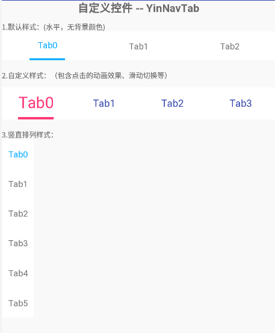

# YinNavTab
安卓自定义控件 --- 导航切换栏（按钮）

1. 自定义TabButton单选按钮 YinTabButton  【Kotlin | 原创】
            版本：v1.0.0
            基本功能：
                        可直接xml布局中使用；
                        只支持点击OnClick,不支持滑动(至于其他的操作，可随意添加接口并实现即可完成)；
                        随意设定title内容和数量，文字大小等常用属性；
                        随意设置标签指示器indicators的宽高颜色
            说明：未提供xml的属性配置，暂时通过代码中setXXX来设置各种属性；具体见代码 /views/YinTabButton；
            使用：暂时直接复制源代码到项目中即可；

