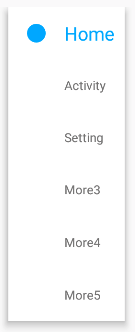

# :running:YinNavTab-Android (Kotlin) :running:

安卓自定义控件 --- 导航切换栏（按钮）

## 目录

* [功能介绍](#功能介绍)
* [整体效果图预览 apk](#整体效果图预览)
* [使用](#使用)
* [自定义属性](#自定义属性)
* [常见问题](#常见问题)


## 功能介绍

   基本功能：

【v1.2.0-release】
- [x] 新增'图文模式'并支持模式一键切换（图片内容、尺寸、间距等多重属性设置）
- [x] 普通文字模式竖直排列时新增圆点（可隐藏、可调大小、间距等多重属性设置）
- [x] tab按钮增加了点击效果

【v1.0.0-release】
- [x] 支持点击、滑动等多种监听事件进行tab切换
- [x] 随意设置tab数量、内容
- [x] 支持横向和纵向
- [x] 滑动或点击附带简单的缩放动画效果
- [x] xml配置内容的各种属性（文字、下标签等尺寸、颜色）


## 整体效果图预览
<div align="center"> </div>


# 使用

### 1.添加 Gradle 依赖

当前最新版本：
[](https://jitpack.io/#Jerry-Yin/YinNavTab)

Step 1. Add the JitPack repository to your build file.  Add it in your root build.gradle at the end of repositories:

	allprojects {
	    repositories {
		...
		maven { url 'https://jitpack.io' }
		}
	}

Step 2. Add the dependency

```groovy
dependencies {
    implementation 'com.github.Jerry-Yin:YinNavTab:latestVersion'   //latestVersion ： 对应的版本号即可
}
```

### 2.布局文件中添加YinNavTab控件进行布局

默认情况为 文字模式-水平排列， 各种情况按需自己设计即可
```xml

//默认为 文字模式1-水平排列， 各种情况按需自己设置对应属性即可
<com.jayyin.developer.yinnavtab.views.YinNavTab
    android:id="@+id/tab"
    android:layout_width="match_parent"
    android:layout_height="45dp">
</com.jayyin.developer.yinnavtab.views.YinNavTab>
```
<div align=center></div>

```xml
// 文字模式2-竖直排列
<com.jayyin.developer.yinnavtab.views.YinNavTab
                        android:layout_width="wrap_content"
                        android:layout_height="250dp"
                        android:layout_marginBottom="10dp"
                        app:orientation="vertical"
                        app:indicatorHeight="15dp"
                        app:indicatorWidth="15dp">
</com.jayyin.developer.yinnavtab.views.YinNavTab>
```
<div align=center></div>

```xml
// 图文模式1-默认水平排列
<com.jayyin.developer.yinnavtab.views.YinNavTab
                    android:id="@+id/tab2_1"
                    android:layout_width="match_parent"
                    android:layout_height="45dp"
                    android:layout_marginTop="5dp"
                    app:mode="drawable">
</com.jayyin.developer.yinnavtab.views.YinNavTab>
```
<div align=center></div>

```xml
// 图文模式2-竖直排列
<com.jayyin.developer.yinnavtab.views.YinNavTab
                        android:id="@+id/tab2_3"
                        android:layout_width="100dp"
                        android:layout_height="250dp"
                        android:layout_marginBottom="10dp"
                        app:mode="drawable"
                        app:orientation="vertical">
</com.jayyin.developer.yinnavtab.views.YinNavTab>

```
<div align=center></div>


### 3.在代码中设置绑定监听事件和其他后续操作

```kotlin
//绑定点击事件
tab.setOnClickListener(object : YinNavTab.OnClickListener {
   override fun onClick(view: View, position: Int) {
       Toast.makeText(this@MainActivity, "clicked tab " + position, Toast.LENGTH_SHORT).show()
   }
})

//绑定滑动事件
tab2.setOnScrollerListener(object : YinNavTab.OnScrollerListener {
    override fun onScroller(view: View, position: Int) {
       Toast.makeText(this@MainActivity, "scrolle to tab " + position, Toast.LENGTH_SHORT).show()
    }
})


其他几个关键方法（除此之外的各种方法建议导入依赖至项目中 直接查看源码即可，都在底部的各种setXXX()方法！）

//.替换图标
 /**
 *@param drawableIds -- 正常状态下的图标id集合
 *@param drawableSelectedIds -- 选中状态下的图标id集合
 */
 setDrawables(drawableIds: ArrayList<Int>, drawableSelectedIds: ArrayList<Int>)

```

# 自定义属性

对应属性，可以直接在xml中进行配置使用，也可以在代码中进行各种setxxx()使用，看自己需求！

```xml
               <!--字体大小-->
               <attr name="textSize" format="dimension|reference"/>
               <!--文字/标签颜色-->
               <attr name="color" format="color|reference"/>

               <!--标签指示器是否显示（默认显示）-->
               <attr name="indicatorsVisible" format="boolean"/>
               <!--指示器宽度-->
               <attr name="indicatorWidth" format="dimension"/>
               <!--指示器高度-->
               <attr name="indicatorHeight" format="dimension"/>
               <!--指示器间距-->
               <attr name="indicatorPaddingRight" format="dimension"/>
               <attr name="indicatorPaddingLeft" format="dimension"/>

               <!--图片尺寸-->
               <attr name="imageWidth" format="dimension"/>
               <attr name="imageHeight" format="dimension"/>
               <attr name="imgPaddingRight" format="dimension"/>
               <attr name="imgPaddingLeft" format="dimension"/>

               <!--显示模式-->
               <attr name="mode">
                   <!--1.文字+下标 （默认）-->
                   <enum name="normal" value="0"/>
                   <!--2.图片+文字 -->
                   <enum name="drawable" value="1"/>
               </attr>

            <!--文字/标签颜色-->
            <attr name="color"/>
            <!--选中时的文字颜色-->
            <attr name="colorSelected" format="color|reference"/>
            <!--文字标题尺寸-->
            <attr name="textSize"/>
            <!--标签数量-->
            <attr name="tabSize" format="integer"/>
            <!--标签指示器是否显示（默认显示）-->
            <attr name="indicatorsVisible"/>
            <!--指示器宽度-->
            <attr name="indicatorWidth"/>
            <!--指示器高度-->
            <attr name="indicatorHeight"/>
            <!--是否缩放动画效果（默认不支持）-->
            <attr name="isScale" format="boolean"/>
            <!--缩放的最大值（int）-->
            <attr name="scaleValue" format="float"/>

            <attr name="orientation">
                <enum name="horizontal" value="0"/>
                <enum name="vertical" value="1"/>
            </attr>

            <attr name="indicatorPaddingRight"/>
            <attr name="indicatorPaddingLeft"/>

            <attr name="mode"/>
            <attr name="imageWidth"/>
            <attr name="imageHeight"/>
            <attr name="imgPaddingRight"/>
            <attr name="imgPaddingLeft"/>
```

# 常见问题

小的控件，一切从简！欢迎使用和提多提完善修改意见！

联系邮箱：
<a href="846597629yjf@gmail.com" target="_blank">846597629yjf@gmail.com</a>

